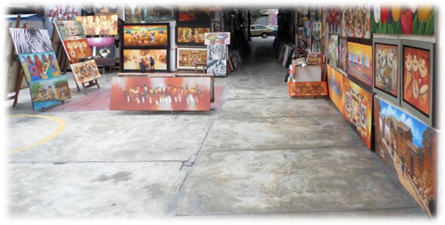
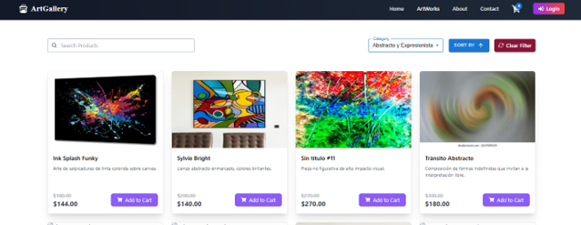
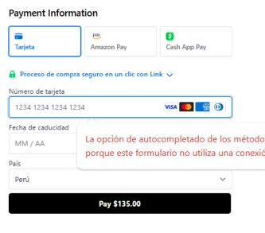
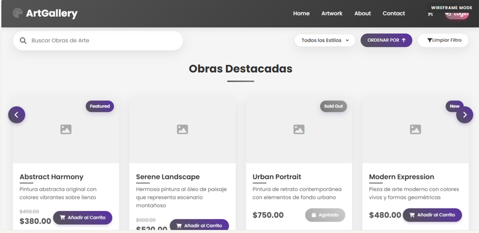
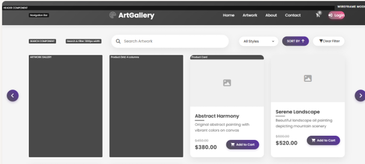

# 🎨 Wuayta — Sistema Web para Exhibición y Venta de Obras de Arte

**Resumen:**
Aplicación **web** diseñada para **galerías de arte**.
Permite la **exhibición de obras**, la **gestión de artistas y clientes**, y el **procesamiento de pagos en línea**.
Fue desarrollada como **prototipo funcional** para *Galerías Wuayta*, integrando tecnologías modernas en frontend y backend.

**Tecnologías:** Java · Spring Boot · React · PostgreSQL · Stripe

---

## ✨ Características clave

### 🖼️ Aplicación Y Negocio (pantallas principales)

### 💳 API de Pagos (Stripe)

*

### 🌐 Página del prototipado (mockup)
Se encuentra disponible un **mockup de alta fidelidad** que permite **interactuar con la propuesta de la aplicación**.

👉 [Ver prototipo interactivo (Wuayta)](https://goo.su/bUKD7)   (https://goo.su/bUKD7) 

 
---

### 🖼️ Funcionalidad principal

* **Catálogo dinámico de obras** con imágenes, precios y descripciones.
* **Registro de artistas y clientes**, con soporte para múltiples roles de usuario.
* **Carrito de compras y pedidos** con flujo completo de compra en línea.
* **Pasarela de pagos (Stripe)** integrada en modo prototipo.
* **Base de datos PostgreSQL** para usuarios, obras y transacciones.

### ⚙️ Arquitectura

* **Backend:** Java 17 + Spring Boot.
* **Frontend:** React.
* **Cliente-servidor moderno** con API REST.

---

## 📦 Estado del Proyecto

🚧 no desplegado

* Flujo completo de compra con pagos Stripe funcional en pruebas locales.
* Demo del **mockup interactivo disponible online**.
* Despliegue en la nube (Heroku / AWS) aún pendiente.

---

## 📂 Estructura del repo

* `frontend/` → Código en React (interfaz de usuario).
* `backend/` → API en Spring Boot (Java).
* `database/` → Scripts de inicialización en PostgreSQL.
* `assets/` → Imágenes de demo y capturas de pantalla.
* `README.md` → Documentación del proyecto (este archivo).

---
## 🔒 Código
**Acceso al código:** disponible bajo solicitud 

